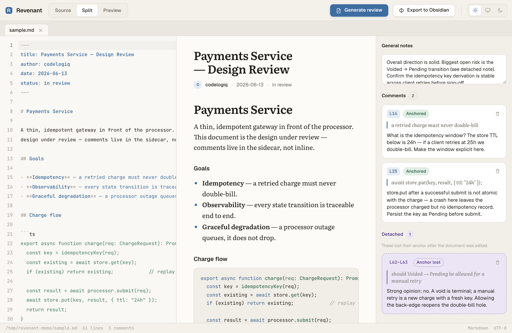
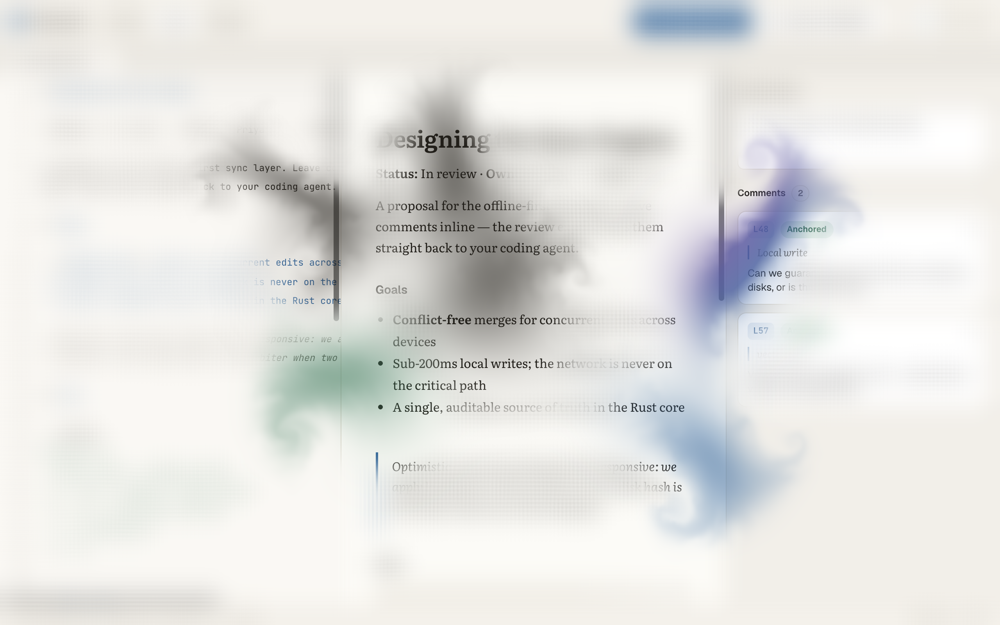
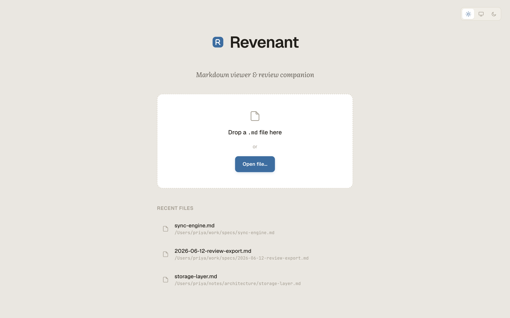
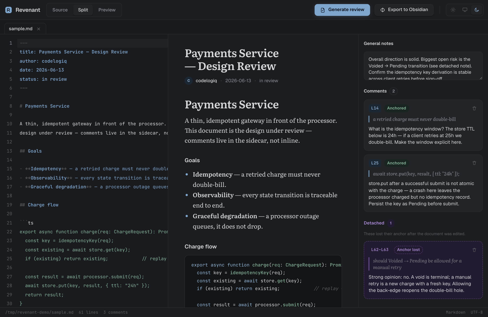

# Revenant

Markdown viewer and review companion — Tauri 2 + Svelte desktop app.

Open markdown files in tabs, edit source, preview rendered output side-by-side, leave anchored annotations, and export an agent-agnostic `.review.md` for any AI reviewer.

## Screenshots

> The "Paper" (light) and "Graphite" (dark) themes — Geist · Literata ·
> JetBrains Mono, steel-blue accent, blue-violet for detached annotations.
> Rendered from the live Svelte frontend; native window chrome omitted.

**Review workspace — source editor, live preview, and annotation drawer**



**Ink-dissolution open transition** — a suminagashi (墨流し) GPU fluid simulation
plays as the first document opens: themed ink swirls across the page while the
strokes "draw" it into focus, then dissolve to reveal the live document.



**Welcome screen**



**Graphite (dark) theme**



## Features

- Single persistent instance: `revenant doc.md` in any terminal focuses the existing window and opens a new tab
- Source editor (CodeMirror 6) + live preview with Mermaid diagrams and syntax highlighting
- Anchored sidecar annotations stored next to the document (`.md.annotations.json`)
- Conflict detection: external edits are surfaced with Reload / Keep mine options
- Export to Obsidian vault (Local REST API or filesystem copy fallback)
- Agent-agnostic review export — no hardcoded AI assistant names in output
- Light / dark / system theme toggle — Paper (warm off-white) and Graphite (near-black) palettes, persisted across sessions and synced live to the OS preference when set to "system"
- Ink-dissolution open transition: a suminagashi (墨流し) GPU fluid simulation (WebGL2 — advection + curl + pressure) dyes ink into water and lets it swirl and dissolve when opening the first document; dependency-free, `prefers-reduced-motion` safe
- Drag-and-drop `.md` files directly onto the window; native file-picker on the welcome screen
- Status bar showing the abbreviated file path, line count, comment count, file type, and encoding

## Prerequisites

- **macOS / Windows** — v1 targets; Linux may work but is untested
- **Rust** ≥ 1.77 — install via [rustup](https://rustup.rs/)
- **Node.js** ≥ 20 + **npm** ≥ 10 — the Tauri CLI is bundled as an npm dev dependency; no separate `cargo install` is required
- **Windows:** the installer uses the WebView2 **download bootstrapper** — WebView2 ships with Windows 11 and Windows 10 21H2+, and the bootstrapper fetches it on older builds. For locked-down or air-gapped machines, build the **fixed-version** variant instead (see [Locked-down Windows](#locked-down-windows-fixed-version-webview2))

## Install

### macOS — from source

```sh
git clone https://github.com/codelogiq/revenant.git
cd revenant
npm install
npm run tauri:build
# Installer at: src-tauri/target/release/bundle/dmg/revenant_*.dmg
```

### Windows — from source

```powershell
git clone https://github.com/codelogiq/revenant.git
cd revenant
npm install
npm run tauri:build
# Installer at: src-tauri\target\release\bundle\nsis\revenant_*_x64-setup.exe
```

> **Windows PATH note:** The NSIS installer registers `revenant` on the system PATH.
> You must open a **new terminal session** after installation for the PATH change to take effect.
> If `revenant` is still not found, run `revenant.exe` from its install directory once, or restart your terminal / IDE.

### Locked-down Windows (fixed-version WebView2)

The default installer relies on the WebView2 download bootstrapper. For machines
with no internet access or where IT policy blocks the bootstrapper, build an
installer that **bundles a fixed version** of the WebView2 runtime — no download
at install time. This is opt-in (it adds ~180 MB to the installer), so it lives in
a config overlay (`src-tauri/tauri.windows-fixed.conf.json`) rather than the
default build.

1. Download the **Fixed Version** runtime CAB (x64) from the
   [WebView2 download page](https://developer.microsoft.com/microsoft-edge/webview2/#download-section).
   The pinned version is `130.0.2849.80`; if you choose another, update the `path`
   in the overlay to match.
2. Expand it into `src-tauri/` so the folder name matches the overlay's `path`
   (PowerShell, from the repo root):

   ```powershell
   expand "Microsoft.WebView2.FixedVersionRuntime.130.0.2849.80.x64.cab" -F:* `
     "src-tauri\Microsoft.WebView2.FixedVersionRuntime.130.0.2849.80.x64"
   ```

3. Build with the overlay merged over the base config:

   ```powershell
   npm run tauri -- build --config src-tauri/tauri.windows-fixed.conf.json
   ```

The runtime folder is git-ignored (never committed). The base build and CI stay on
the bootstrapper.

## Usage

```sh
# Open a file (creates or focuses the existing window)
revenant path/to/document.md

# Open multiple files
revenant README.md docs/spec.md

# Print version
revenant --version
```

## Development

```sh
# Install JS dependencies
npm install

# Start Tauri dev server (hot-reload)
npm run tauri:dev

# Run frontend tests
npm test

# Run Rust tests
cargo test --manifest-path src-tauri/Cargo.toml

# Production build
npm run tauri:build
```

## Architecture

| Layer | Technology |
|-------|-----------|
| Frontend | Svelte 5 + TypeScript + Vite |
| Desktop shell | Tauri 2 (Rust) |
| Editor | CodeMirror 6 |
| Markdown render | markdown-it + DOMPurify + Mermaid + highlight.js |
| Design tokens | `src/lib/styles/tokens.css` — semantic CSS custom properties; Paper (light) and Graphite (dark) palettes on a single token layer |
| Theming | `src/lib/stores/theme.ts` + `ThemeToggle.svelte` — light / dark / system mode, OS media-query sync, persisted to localStorage |
| Typography | Geist (UI) · Literata (prose) · JetBrains Mono (editor/code) — self-hosted offline via `@fontsource` packages (no CDN) |
| Open transition | `src/lib/fx/fluid.ts` + `Suminagashi.svelte` — WebGL2 GPU fluid simulation (Navier-Stokes: advection + curl + pressure), dependency-free, `prefers-reduced-motion` safe |
| File picker | `tauri-plugin-dialog` — backs the welcome-screen "Open file…" button |
| CLI integration | `tauri-plugin-cli` — `revenant --version` and positional file arguments |
| Annotation storage | JSON sidecar (`.md.annotations.json`) next to each document |
| Fuzzy re-anchoring | `similar` crate (Rust) — content-hash short-circuit + ≥0.75 normalized similarity |
| Obsidian export | Local REST API + filesystem fallback |
| Secrets | OS keychain via `keyring` crate (no plaintext REST keys) |

See `docs/` for the full design spec and implementation plan.

## Annotation sidecars and git

On first annotation, Revenant adds `*.annotations.json` to the nearest `.gitignore`
so sidecars never dirty `git status`. Review export files (`*.review.md`) are also excluded.

## Security

- All file I/O goes through the Rust core — the webview has no blanket filesystem ACL
- Markdown output is sanitized with DOMPurify before injection into the preview
- Obsidian REST API key stored in the OS keychain, never in config JSON
- Strict Tauri CSP configured for Mermaid compatibility
