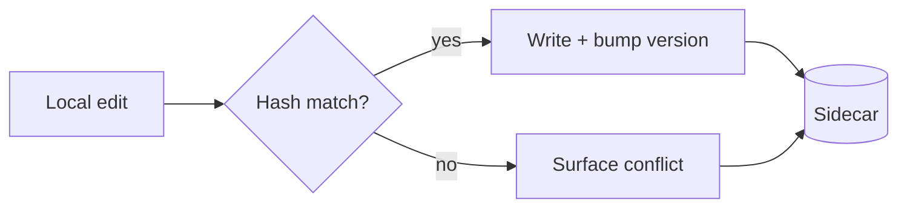
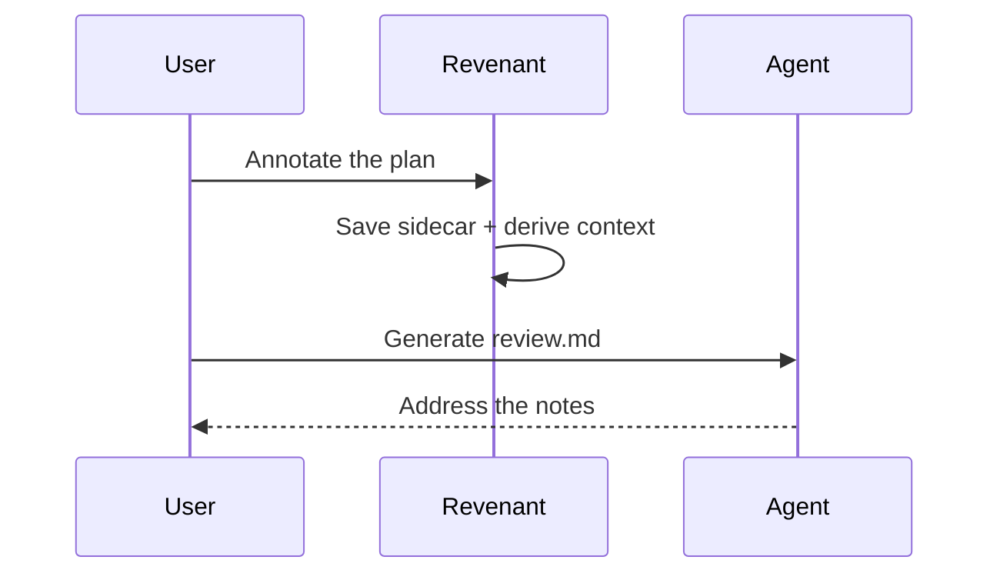
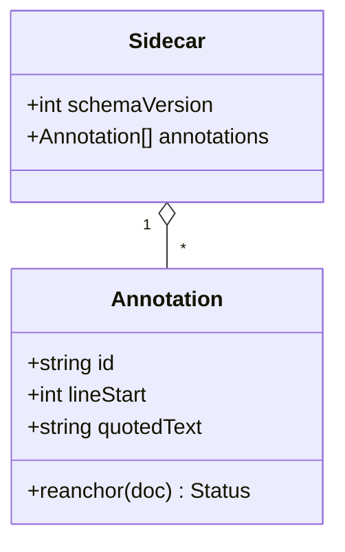
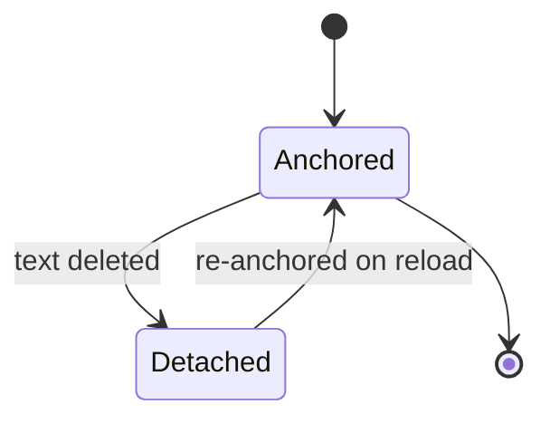
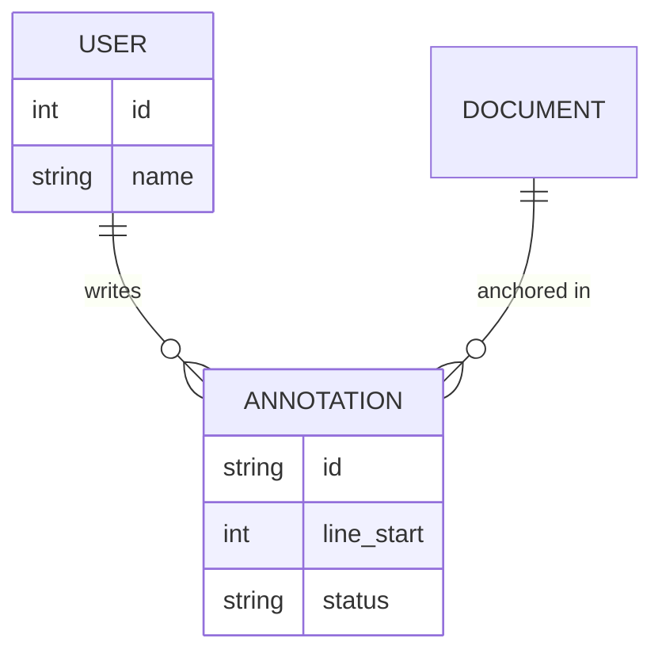
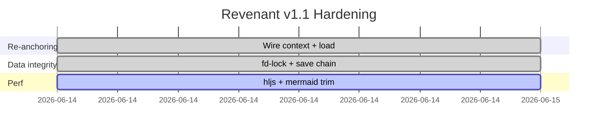
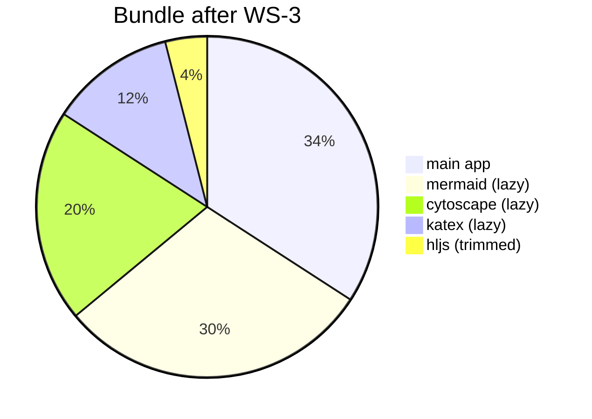
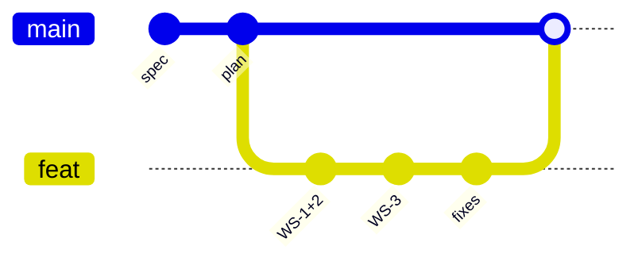

# Mermaid Diagrams Sample

Open this in Revenant (Preview or Split) and confirm each block renders as a
**diagram**, not as raw text. These are the diagram types WS-3 keeps; if any one
renders as plain code or an error box, tell me which.

## Flowchart

## Sequence

## Class

## State

## Entity Relationship

## Gantt

## Pie

## Git Graph

